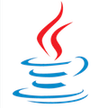

# ExositeReady™ Device Connectivity Enablement Software

# 

ExositeReady™ software is code created by Exosite or in collaboration with partners to give developers software for their hardware platform, no matter if it is a small embedded microcontroller or a Linux based industrial computer gateway.  We provide libraries, demo and reference code, in addition to production quality offerings like the ExositeReady™ Embedded SDK.  Code and hardware ports that have gone through the ExositeReady™ Certitication program meeting high criteria for functionality, testing, and quality are marked as __ExositeReady™ Certified__.

* [ExositeReady™ Certified](#exositeready-certified)
* [Embedded SDK](#embedded-sdk)
* [Device Libraries](#device-libraries)
* [Reference Code, Demos, and Examples](#reference-code-demos-and-examples)
* [For Partners](#exositeready-for-partners)
* [Support](#support-inquiries)
* [Other Hardware & Development Kit Support](#other-hardware-development-kit-support)

# ExositeReady™ Certified
Production quality IoT device client code created, certified, and supported by Exosite.

## EMBEDDED SDK
The ExositeReady™ Certified Embedded open-source SDK contains a framework, platform porting level, and utilities written in C for embedded devices. This SDK implements Exosite platform specific APIs and platform interactions in addition to providing an example application for each hardware platform port. The SDK is for engineers developing firmware for their embedded device products.

* [SDK Source Code](https://github.com/exositeready/er_sdk) - Note that hardware ports are listed below
* [SDK Documentation](http://exositeready.github.io/) - Includes application API, porting guide, and examples

Ports to specific hardware platforms can be found by clicking on our partner below. Each port contains platform specific source code, instructions for building, a binary for evaluation, and instructions for using the example application.

<table width="100%">
    <tr>
      <th colspan="2" style="font-weight: bold;">ExositeReady™ Embedded SDK Hardware Platform Ports</th>
    </tr>
    <tr>
        <td style="text-align: center;"></td>
        <td style="width:80%;padding-top:40px;padding-bottom:40px;">[Microchip Hardware Platforms ExositeReady Embedded SDK Ports](microchip)</td>
    </tr>
</table>

# Device Libraries

<table width="100%">
    <tr>
      <th colspan="2" style="font-weight: bold;">ExositeReady™ Device Libraries</th>
    </tr>
    <tr>
        <td style="text-align: center;"></td>
        <td style="width:80%;padding-top:40px;padding-bottom:40px;">[One Platform C Library as a part of Embedded SDK](https://github.com/exositeready/er_sdk)</td>
    </tr>
    <tr>
        <td style="text-align: center;"></td>
        <td style="width:80%;padding-top:40px;padding-bottom:40px;">[Arduino Exosite Library](https://github.com/exosite-garage/arduino_exosite_library)</td>
    </tr>
    <tr>
        <td style="text-align: center;"></td>
        <td style="width:80%;padding-top:40px;padding-bottom:40px;">[One Platform Python Library](https://github.com/exosite-labs/pyonep)</td>
    </tr>
    <tr>
        <td style="text-align: center;"></td>
        <td style="width:80%;padding-top:40px;padding-bottom:40px;">[One Platform Node Library ](https://github.com/exosite-labs/node-onep)</td>
    </tr>
    <tr>
        <td style="text-align: center;"></td>
        <td style="width:80%;padding-top:40px;padding-bottom:40px;">[One Platform C++ Library ](https://github.com/exosite-labs/cpponep)</td>
    </tr>
    <tr>
        <td style="text-align: center;"></td>
        <td style="width:80%;padding-top:40px;padding-bottom:40px;">[One Platform Java Library ](https://github.com/exosite-labs/javaonep)</td>
    </tr>
    <tr>
        <td style="text-align: center;"></td>
        <td style="width:80%;padding-top:40px;padding-bottom:40px;">[One Platform Go Library ](https://github.com/exosite-labs/goonep)</td>
    </tr>     
</table>

# Reference Code, Demos, and Examples
Exosite has provided reference code for or worked with partners on a number of hardware platforms, development kits, and open source platforms. Information on these may be found below and in [Exosite Garage](https://github.com/exosite-garage).

<table width="100%">
    <tr>
      <th colspan="2" style="font-weight: bold;">Hardware Platform Examples, Demos, and Reference Code</th>
    </tr>
    <tr>
        <td style="text-align: center;"></td>
        <td style="width:80%;padding-top:40px;padding-bottom:40px;">[Arduino  Examples](https://github.com/exosite-garage/arduino_exosite_library)</td>
    </tr>
    <tr>
        <td style="text-align: center;"></td>
        <td style="width:80%; padding-top:40px;padding-bottom:40px;">[Microchip Hardware Platform Support](microchip)</td>
    </tr>
    <tr>
        <td style="text-align: center;"></td>
        <td style="width:80%; padding-top:40px;padding-bottom:40px;">[Texas Instruments Hardware ExositeReady Code](texasinstruments)</td>
    </tr>
    <tr>
        <td style="text-align: center;"></td>
        <td style="width:80%; padding-top:40px;padding-bottom:40px;">[MultiTech Hardware Platform Support](misc_platforms#multitech-exositeready-platforms)</td>
    </tr>
    <tr>
        <td style="text-align: center;"></td>
        <td style="width:80%; padding-top:40px;padding-bottom:40px;">[Qualcomm Hardware Platform Support](misc_platforms#qualcomm-exositeready-platforms) </td>
    </tr>
    <tr>
        <td style="text-align: center;"></td>
        <td style="width:80%; padding-top:40px;padding-bottom:40px;">[Synapse Wireless Hardware Platform Support](misc_platforms#synapse-wireless-exositeready-platforms) </td>
    </tr>
    <tr>
        <td style="text-align: center;"></td>
        <td style="width:80%; padding-top:40px;padding-bottom:40px;">[Renesas Hardware Platform Support](renesas)</td>
    </tr>
    <tr>
        <td style="text-align: center;"></td>
        <td style="width:80%; padding-top:40px;padding-bottom:40px;">[Gainspan Hardware Platform Support](misc_platforms#gainspan-exositeready-platforms)</td>
    </tr>
    <tr>
        <td style="text-align: center;"></td>
        <td style="width:80%; padding-top:40px;padding-bottom:40px;">[Broadcom Hardware Platform Support](misc_platforms#broadcom-exositeready-platforms)</td>
    </tr>
</table>

# ExositeReady™ for Partners
For vendors who are interested in partnering with Exosite on providing ExositeReady™ enabled hardware and development kits, please contact [support@exosite.com](mailto:support@exosite.com). Exosite allows vendors to contribute ports that meet the requirements of the ExositeReady program.

# Support & Inquiries
The [developer forum](https://community.exosite.com/c/hardware-platforms) is the best place to get and find help.
