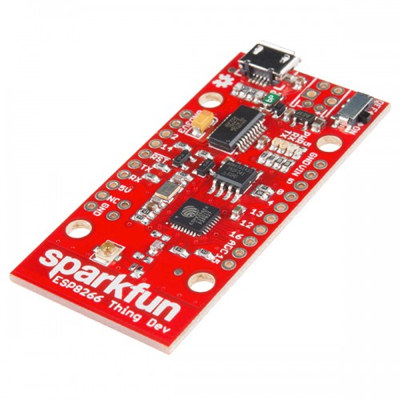
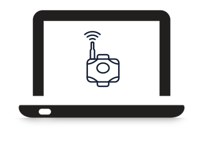

# Getting Started with Murano
When creating an account, Exosite provides examples templates to give you a quick-start for creating Products and Solution applications.  This includes setting up a Product, connecting a physical device (or device simulator), interacting with device data on a dashboard and steps to walk through cloning a solution application and deploying it - allowing you to interact with your device via a fully custom web application in minutes.

## Quick-Start: Creating a Product
You can choose from several starting points when creating a product depending on if you have physical hardware, plan to use simulated device software, or manual API commands.   Each of these provides instructions for creating the product, defining it, and adding devices.

<table width="100%">
    <tr>
      <th colspan="2" style="font-weight: bold;">Murano Product Getting Started Device Examples</th>
    </tr>
    <tr>
        <td style="text-align: center;"></td>
        <td style="width:80%;padding-top:40px;padding-bottom:40px;">[IoT Thing Dev board by Sparkfun - Arduino based example code and Hook-up Guide](products/esp8266_thingdev_murano_smart_lightbulb)</td>
    </tr>
    <tr>
        <td style="text-align: center;"></td>
        <td style="width:80%;padding-top:40px;padding-bottom:40px;">[Manually Activate and Write Data using API commands](products/manualdevice)</td>
    </tr>
    <tr>
        <td style="text-align: center;"></td>
        <td style="width:80%;padding-top:40px;padding-bottom:40px;">[Python Device Simulator Script](products/pythonsim)</td>
    </tr>
</table>

At the end of these walk-throughs, you should have a physical device or simulated device that represents a Smart Lightbulb:
 * Connected to the Murano Platform
 * Reporting sensor data
 * Remote on/off control

## Quick-Start: Creating Application Solutions
Murano walks you through cloning and deploying a sample Smart Light bulb consumer application.  

<table width="100%">
    <tr>
      <th colspan="2" style="font-weight: bold;">Murano Solution - Getting Started Examples</th>
    </tr>
    <tr>
        <td style="text-align: center;"></td>
        <td style="width:80%;padding-top:40px;padding-bottom:40px;">[Murano Solution Application Getting Started](solutions/exampleapp)</td>
    </tr>
</table>    

The example consumer application provides all the source code, template files, and configuration for building and deploying a connected product and application.  At the end of this walk-through, you should have a deployed web application that has:
 * Unique user sign-up and log-in
 * Ability for users to claim ownership of devices
 * Users can see device sensor data and turn the light on/off
 * Users can invite a shared user to access the light.  
