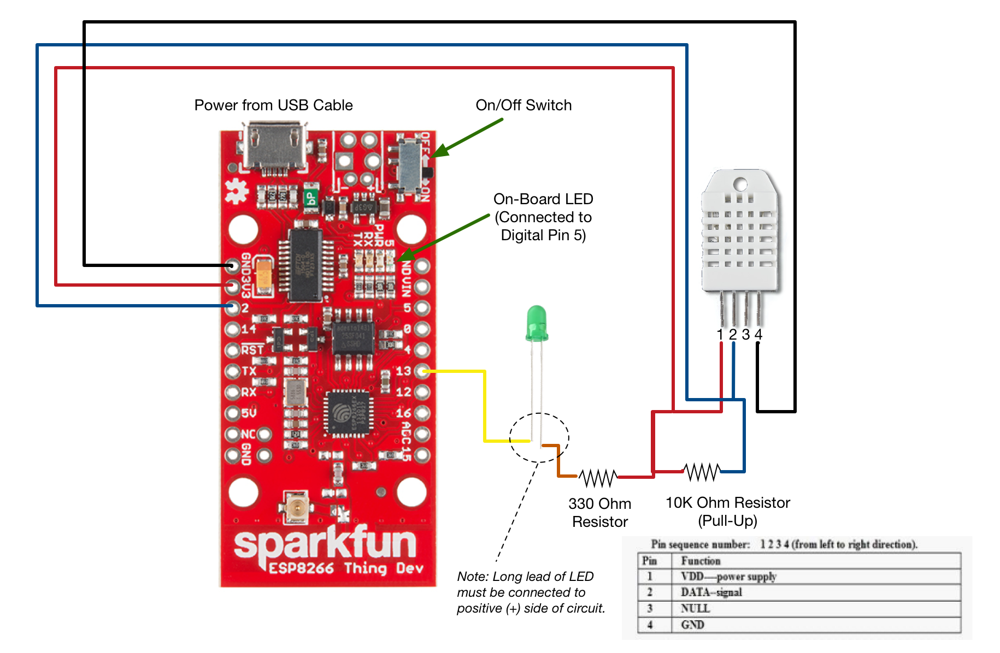
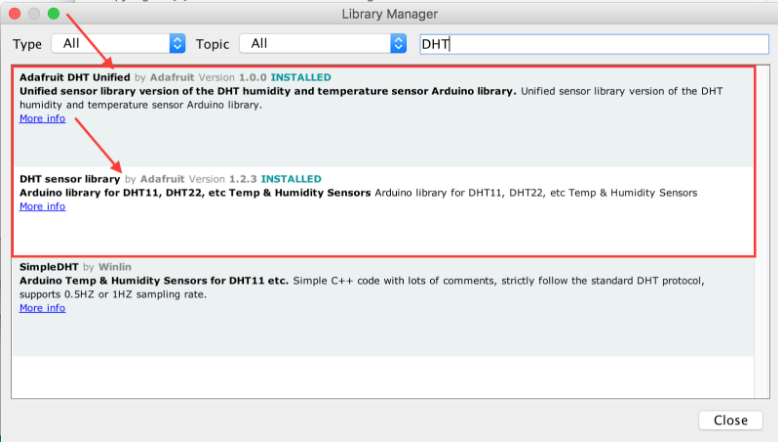
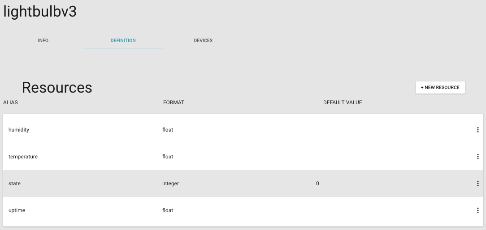
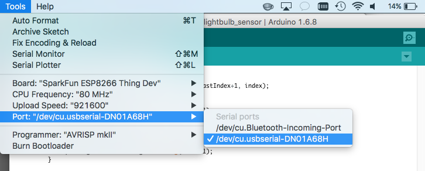
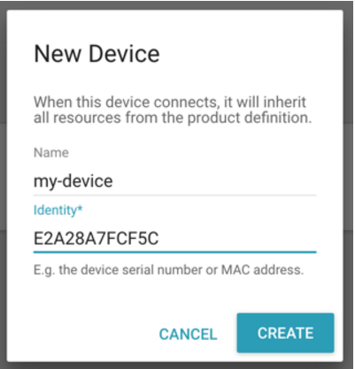
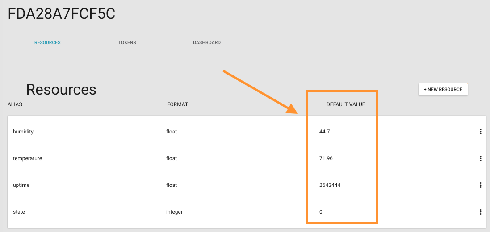
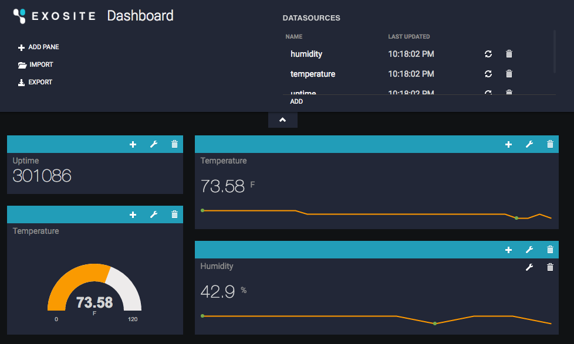

# Exosite Murano Example - ESP8266 Thing Dev Board as WiFi Smart Lightbulb

This example walks through setting up a ESP8266 Thing Dev Board to act as a Smart Lightbulb
with Murano.  Users can feel free to customize after walking through this guide as you'll have
created a full Product instance that supports a deployment of devices specific to that Product.
Product definition can be updated and more devices can be added.  After walking through these steps,
users will be interacting with live device data using a prototype developer dashboard tool.  
After this, users can go through the Murano Solution examples to deploy a Example consumer web application
that works with this product demo.

# Hardware Setup

## Hardware
* [Sparkfun ESP8266 Thing - Dev Board](https://www.sparkfun.com/products/13711)
* [Humidity and Temperature Sensor - RHT03 ](https://www.sparkfun.com/products/10167)
* 1 10K Ohm Resistors (for digital pin pull-up)
* 1 330 Ohm Resistor
* 1 LED (suggest green or yellow)
* Micro-USB B Cable

## Hook-up Guide



# Software Setup
## Setup Arduino IDE and Libraries
0. Install Arduino (if you haven't used it before) [arduino.cc](https://www.arduino.cc/en/Main/Software)
1. Install ESP8266 Thing Dev Board support using Arduino Board Manager - [ESP8266 Thing Dev Board Install Directions ](https://learn.sparkfun.com/tutorials/esp8266-thing-hookup-guide/installing-the-esp8266-arduino-addon)
2. Install Exosite Arduino Library  - Use Arduino Library Manager, search for `Exosite`. _(Make sure you have Version 2.4.1 or greater)_

   _More info: [Exosite Arduino Library Details](https://github.com/exosite-garage/arduino_exosite_library)_
   
   

3. Install [Adafruit DHT Library](https://github.com/adafruit/DHT-sensor-library) - You can use Arduino Library Manager, search for `DHT`
4. Install [DHT Sensor Library](https://github.com/adafruit/DHT-sensor-library) - You can use Arduino Library Manager, search for `DHT`
   


# NEW TO ARDUINO?
_Arduino is a powerful software platform for quickly building applications on embedded hardware.  Although typically easier than most any other software IDEs and compilers, it can still be a learning experience for new users. Once installed quickly with the necessary libraries, users will find they can customize and build applications in minutes.  Here are a few links to get an understanding of Arduino since this guide does not cover every concept of the Arduino IDE and hardware concepts (in this case the SparkFun ESP8266 Thing Dev Board) Note that Arduino supports a number of hardware platforms, not just Arduino branded boards themselves, like the ESP8266 Thing Dev Board._

* [Sparkfun ESP8266 Thing - Dev Board](https://www.sparkfun.com/products/13711)
* [Arduino Getting Started](https://www.arduino.cc/en/Guide/HomePage0)


# Murano Product Setup
## Create Your Product.

1. Create a Product in Murano.  

   When creating a product, Murano allows you to use a `product template` spec file to setup the product definition. For this example, you can use the following url (copy the whole thing):

  ```https://raw.githubusercontent.com/exosite-garage/arduino_exosite_library/master/examples/Murano-SmartLightBulb-ThingDevBoard/product_spec_smart_lightbulb_example.yaml```

  
  

  After creating a product, devices need two pieces of information to activate with the platform.  These are the Product ID when you create your product and a unique identifier serial number.  The Product ID can be found on the `Info` tab on the Product page.

  

  The Unique Identifier or Serial Number is device firmware specific.  In this situation, the Exosite Arduino library uses the device's pre-programmed MAC Address.  You'll need to get this from the debug serial output when you run the Arduino example code in a moment.

  __Note__: If you did not use the template previous step, you can manually set up your Product Definition. Go to the Product Definition Tab and set up your dataport resources as specified here.

  * alias: _temperature_, format: _float_
  * alias: _humidity_, format: _float_
  * alias: _uptime_, format: _integer_
  * alias: _state_, format: _integer_

  

  Set the default value for `state` to 0 so the device has a default value it reads to know to turn   on or off the LED. Click on the `state` resource in the Definition tab and write a 0 to the value.

  

  Before we add a device, we'll start the Arduino Thing Dev Board device application.
    _Note: We do not yet have the device's MAC address, so wait on adding the device. We get the MAC Address from the debug output of the device application_

## Create and Run the example application

1. Create a new Arduino Sketch.
2. Get the Example Sketch from the Exosite library called 'murano_example_smart_lightbulb_sensor', which will load a new Sketch with the example device application code.

   

5. In your sketch, edit the WiFi configuration parameters for your local WiFi network (SSID and Password).  
   

6. In your sketch, edit Exosite Product ID from your Murano product
   

7. Make sure board is connected to your computer via USB port and select the correct Port from the Arudino Tools menu.
   

8. Select the correct board before you compile your code from the Tools menu.
   

9. Click the Upload button which will first compile and then download to your plugged in board.
   

8. Open the Serial Monitor.  
   

9. Copy Device Identifier (MAC Address) from the Serial Monitor Output.  
   
   _(You can click the Autoscroll if the log window goes past the top)_

## Add Device to Murano Product
1. Add Device to Product in Murano using the Device Identifier (MAC Address)
  
  
2. If you have used this hardware before with Exosite's Library, restart your Device by either using the boards On/Off Switch or Uploading your Sketch again to the board.  
2. Verify Device Provisions using the Arduino Serial Output.
if previously used and may have a old CIK (private device API key) stored in it's non-volatile memory (EEPROM).
   
3. View Device Resources (click on device)
   

## Run the Product Dashboard Developer Tool
1. On the Device page, click the 'Dashboard' tab - which is a link to the Murano Product Dashboard Developer Tool.  This opens a new browser tab.  
   
   
2. Add a pane, then add a widget to the pane.
  
3. Interact with live data
  
4. Done!
