If you don’t already have a Murano account

<a class="btn orange" href="https://exosite.com/business/signup">Sign Up for Beta Access to Murano</a>

**NOTE: This board has a known issue when using Arduino on a Windows machine. Please make digital pin 0 grounded, or use a Linux machine to complete this tutorial.**


# Murano Example - ESP8266 Thing Dev Board as WiFi Smart Lightbulb

This example walks through setting up a ESP8266 Thing Dev Board to act as a Smart Lightbulb
with Murano.  Users can feel free to customize after walking through this guide as you'll have
created a full Product instance that supports a deployment of devices specific to that Product.
Product definition can be updated and more devices can be added.  After walking through these steps,
users will be interacting with live device data using a prototype developer dashboard tool.  

After this, users can go through the Murano Solution examples to deploy a Example consumer web application
that works with this product demo.

# Hardware Setup

## Hardware
* [Sparkfun ESP8266 Thing - Dev Board](https://www.sparkfun.com/products/13711)
* [Humidity and Temperature Sensor - RHT03 ](https://www.sparkfun.com/products/10167)
* 1 10K Ohm Resistors (for digital pin pull-up)
* 1 330 Ohm Resistor
* 1 LED (suggest green or yellow)
* Micro-USB B Cable

## Hook-up Guide


# Software Setup
## Setup Arduino IDE and Libraries
0. [Install Arduino](https://www.arduino.cc/en/Main/Software) if you haven't used it before). New to Arduino? Check out the [Arduino Get Started page](https://www.arduino.cc/en/Guide/HomePage).

1. Paste this link into your board manager (Arduino > Preferences) to install ESP8266 Thing Dev Board: [ESP8266 Thing Dev Board Install Directions ](https://learn.sparkfun.com/tutorials/esp8266-thing-hookup-guide/installing-the-esp8266-arduino-addon)

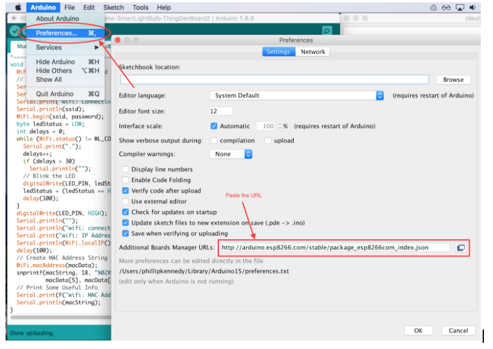


2. Install Exosite Arduino Library, Adafruit DHT Unified, and DHT Sensor Library - Use Arduino Library Manager, search for `Exosite` and `DHT`. _(Make sure you have Version 2.4.1 or greater)_


3. Create a new Arduino Sketch   

4. Get the Example Sketch from the Exosite library called ‘murano_example_lightbulb_sensor’, which will load a new Skitch with the example device application code. 

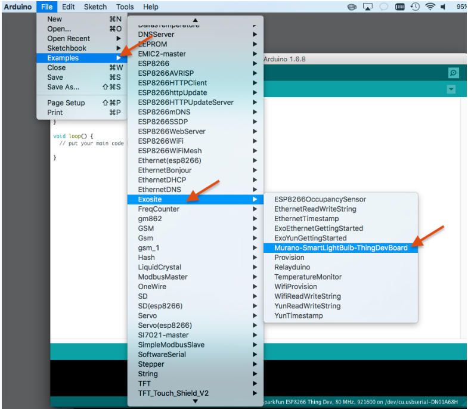

5. In your sketch, edit the WiFi configuration parameters for your local WiFi network (SSID and password). 

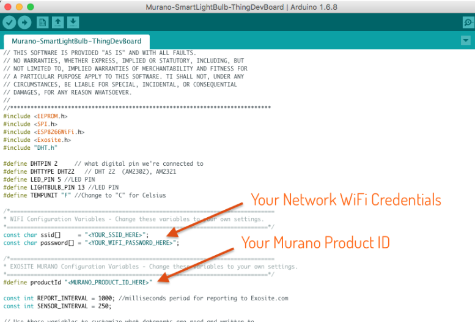

You can get your product ID in Murano > Products > Info Tab: 

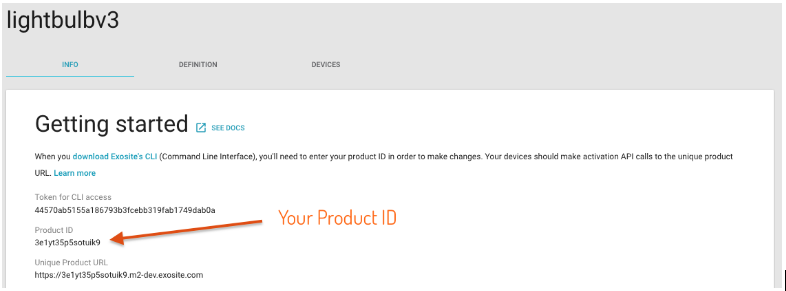

6. Make sure your board is connected to your computer via USB port and select the correct port from the Arduino Tools menu. 

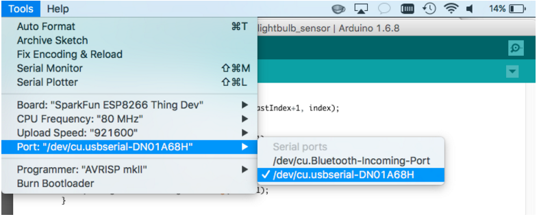

7. Select the correct board before you compile your code from the Tools menu. 

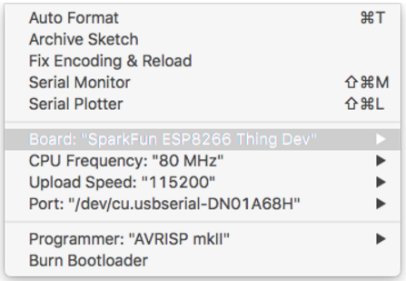

8. Open the Serial Monitor and set it to 115200 Baud.


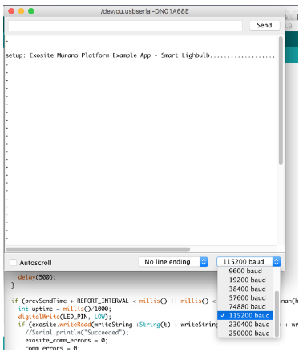

9. Click the “upload” button, which will first compile and download to your plugged in board.


10. Copy Device Identifier (MAC Address) from the Serial Monitor. **Note: If you get comm errors, try unplugging the USB cord from your computer and plugging it back in.**

 

# NEW TO ARDUINO?
_Arduino is a powerful software platform for quickly building applications on embedded hardware.  Although typically easier than most any other software IDEs and compilers, it can still be a learning experience for new users. Once installed quickly with the necessary libraries, users will find they can customize and build applications in minutes.  Here are a few links to get an understanding of Arduino since this guide does not cover every concept of the Arduino IDE and hardware concepts (in this case the SparkFun ESP8266 Thing Dev Board) Note that Arduino supports a number of hardware platforms, not just Arduino branded boards themselves, like the ESP8266 Thing Dev Board._

* [Sparkfun ESP8266 Thing - Dev Board](https://www.sparkfun.com/products/13711)
* [Arduino Getting Started](https://www.arduino.cc/en/Guide/HomePage0)


# Murano Product Setup
## Create Your Product.

1. Create a Product in Murano.  

   When creating a product, Murano allows you to use a `product template` spec file to setup the product definition. For this example, you can use the following url (copy the whole thing):

  ```https://raw.githubusercontent.com/exosite-garage/arduino_exosite_library/master/examples/Murano-SmartLightBulb-ThingDevBoard/product_spec_smart_lightbulb_example.yaml```

  
  

  After creating a product, take note of the Product ID which will be used for the Arduino Sketch in later steps.  The Product ID can always be found on the `Info` tab on the Product page.

  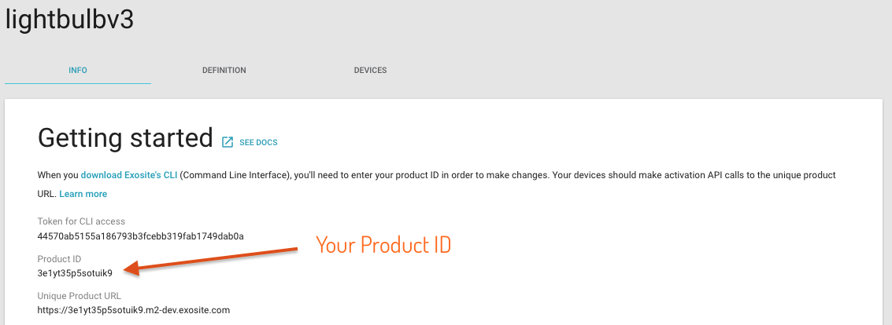

  Your `Definition` tab should look like this:
  

  _Note: If you did not use the template previous step, you can manually set up your Product Definition. Go to the Product Definition Tab and set up your dataport resources as specified here. Also, set the default value for `state` to 0 so the device has a default value it reads to know to turn on or off the LED. Click on the `state` resource in the Definition tab and write a 0 to the value._

  * alias: _temperature_, format: _float_
  * alias: _humidity_, format: _float_
  * alias: _uptime_, format: _integer_
  * alias: _state_, format: _integer_

  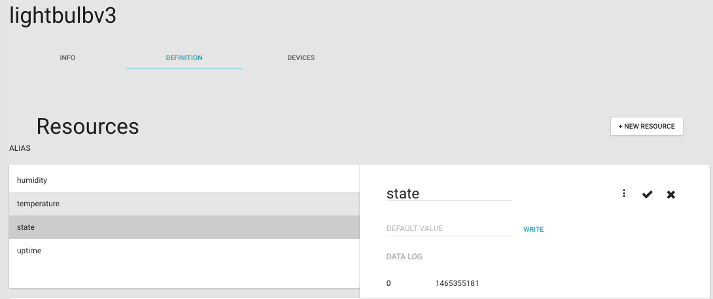

  Before we add a device, we'll start the Arduino Thing Dev Board device application.
    _Note: We do not yet have the device's MAC address, so wait on adding the device. We get the MAC Address from the debug output of the device application_

## Create and Run the example application

1. Create a new Arduino Sketch.
2. Get the Example Sketch from the Exosite library called 'murano_example_smart_lightbulb_sensor', which will load a new Sketch with the example device application code.

   

5. In your sketch, edit the WiFi configuration parameters for your local WiFi network (SSID and Password).  
   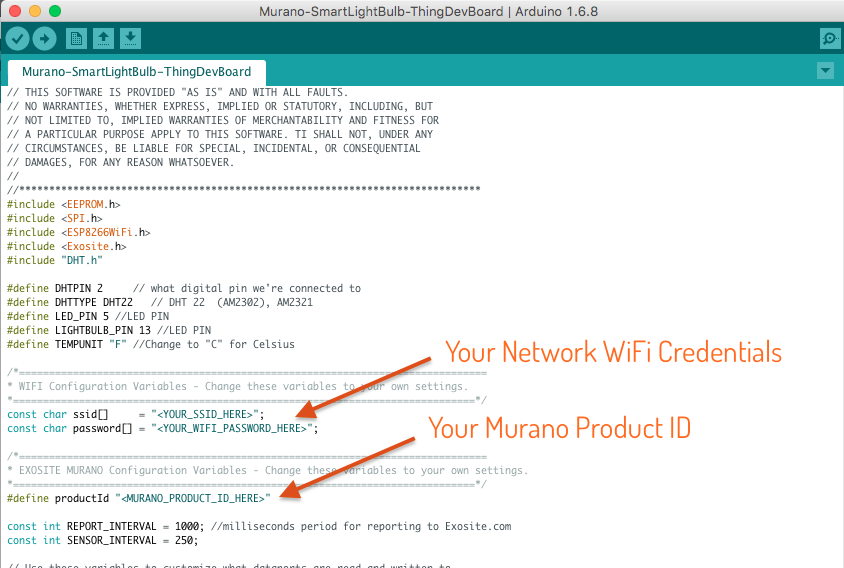

6. In your sketch, edit Exosite Product ID from your Murano product
   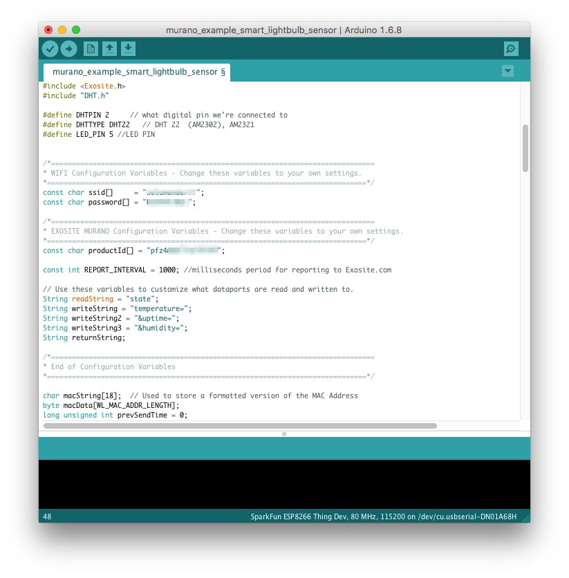

7. Make sure board is connected to your computer via USB port and select the correct Port from the Arudino Tools menu.
   

8. Select the correct board before you compile your code from the Tools menu.
   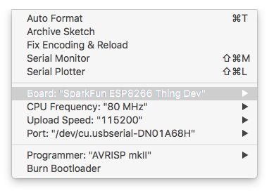

9. Click the Upload button which will first compile and then download to your plugged in board.
   

8. Open the Serial Monitor.  
   

9. Copy Device Identifier (MAC Address) from the Serial Monitor Output. _The Unique Identifier or Serial Number is device firmware specific.  In this situation, the Exosite Arduino library uses the device's pre-programmed MAC Address._ 
   
   _(You can click the Autoscroll if the log window goes past the top)_


## Add Device to your project 

1. Add Device to Product in Murano using the Device Identifier (MAC Address)
  
  

2. RE-DO Step 11 - Upload the Arduino Sketch to the board again. 
 
2. Verify Device Provisions using the Arduino Serial Output.
If previously used, it may have an old CIK (private device API key) stored in it's non-volatile memory (EEPROM).

   

3. Click on your device to make sure data is showing up 

   

4. Click on ‘Dashboard’

	

You will then see

	

5. Add a text pane for temperature and include sparkline

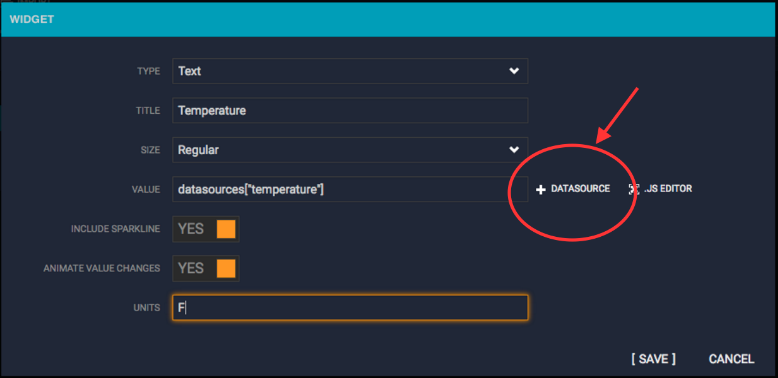

6. Do the same for humidity. 

7. Add a toggle switch for your light (use datasource: state)

8. Interact with live data! Turn your lightbulb on and off from the dashboard.


**You now have a device connected to Exosite’s Murano IoT Platform!** 

__Any device that connects as that same product will inherit the same resources.__

[Next, create a Solution!](http://beta-docs.exosite.com/murano/get-started/solutions/exampleapp/) 


## Run the Product Dashboard Developer Tool
1. On the Device page, click the 'Dashboard' tab - which is a link to the Murano Product Dashboard Developer Tool.  This opens a new browser tab.  
   
   
2. Add a pane, then add a widget to the pane.
  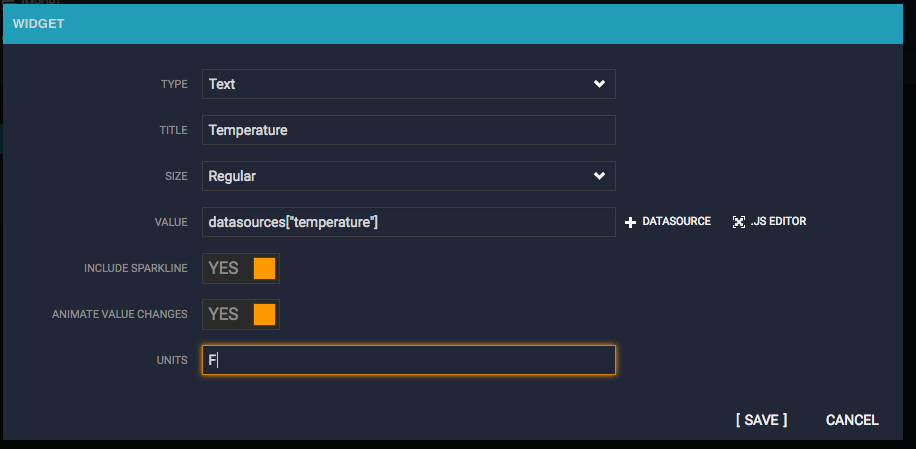
3. Interact with live data
  
4. Done!
