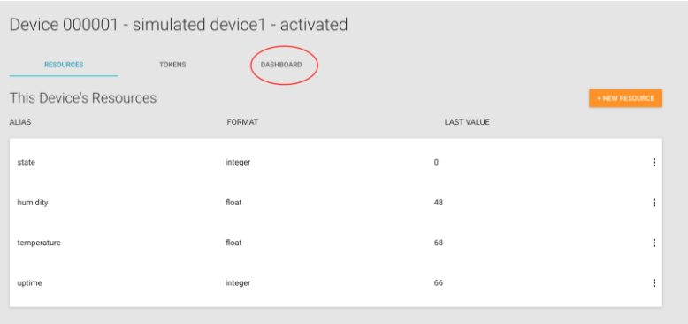
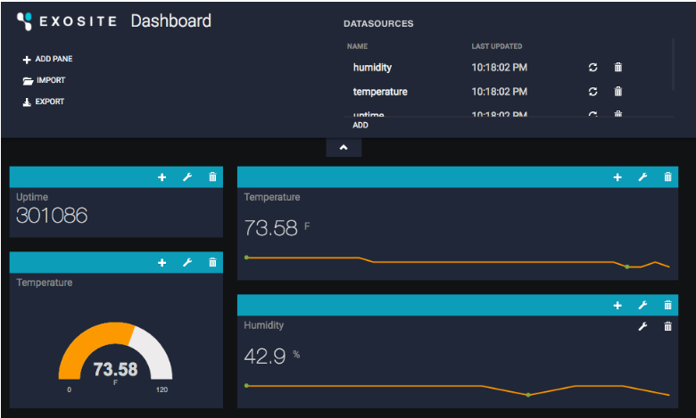
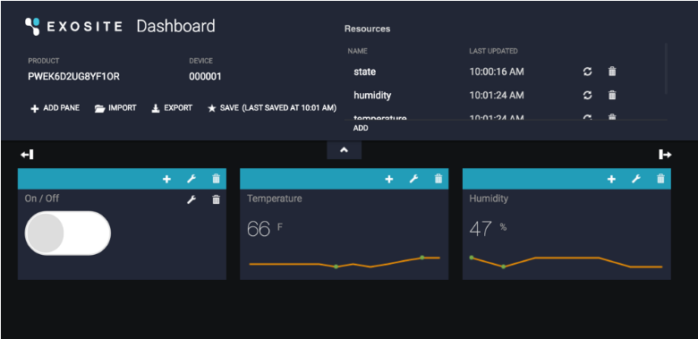
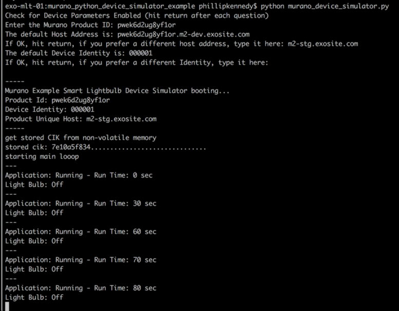

# SIMULATE A DEVICE USING A PYTHON SCRIPT

**NOTE: This is a technical tutorial. You’ll need some familiarity with your operating system's terminal. In order to complete this tutorial you will need python installed on your system.**

If you haven’t already, [CREATE A PRODUCT](http://beta-docs.exosite.com/murano/get-started/)

If you haven’t used it before, download and install [Python](https://www.python.org/) 

Open your OS terminal and clone the python simulator repo
```
git clone https://github.com/exosite/murano_python_device_simulator_example.git
```

```
Cd murano_python_device_simulator_example
```

Run the device simulator
```
Python murano_device_simulator.py
```

It will ask you for your ProductID. On your browser, navigate to your product on Exosite and copy your Product ID


Paste it into terminal and hit enter


Next, it will prompt you if you want to change the Device Identifier from the default of 000001. We recommend to start with this, just hit the enter key to use 000001.

The script should begin running and will mention that it is not activated. Now “Add a Device” on your browser with the same identity you just set (if you didn’t change it, the default is 000001).


Checking back with the Terminal window, the script should show that it activated and stored the CIK.

Also, if you click on the Device's Resources tab, you should active data there.

OPEN THE DEVICE DASHBOARD

On your browser, select the device you just created (most likely 000001)

Select “Dashboard”




Add a text pane for temperature and include sparkline

 

Do the same for Humidity

Add a toggle switch for your light (use resource: state)

Interact with live data, and turn on and off your lightbulb 



Interact with live data, see changes in script’s log



Example: By toggling Dashboard widget that toggles the 'state' resource from 0 to 1, the script log will show the simulated light bulb turning on / off.



Awesome! Now you have a simulated device pumping data into Exosite.

Next, [CREATE A SOLUTION](http://beta-docs.exosite.com/murano/get-started/solutions/exampleapp/)


