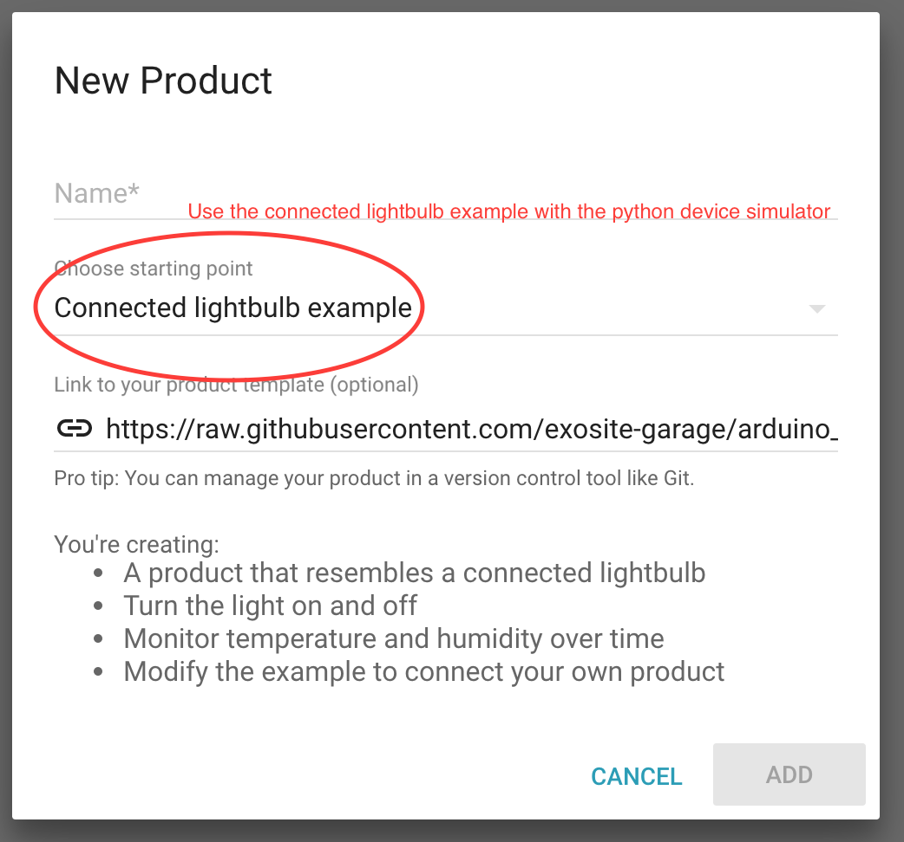
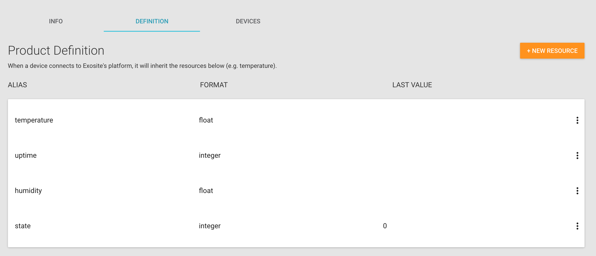
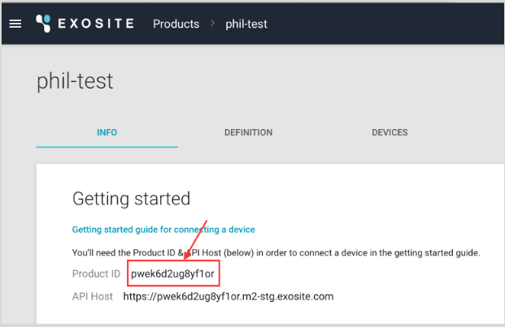
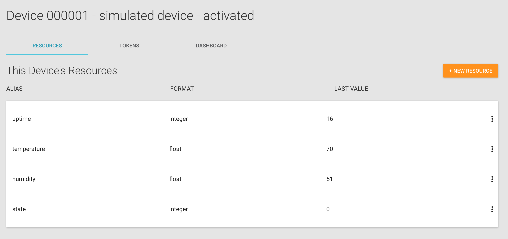
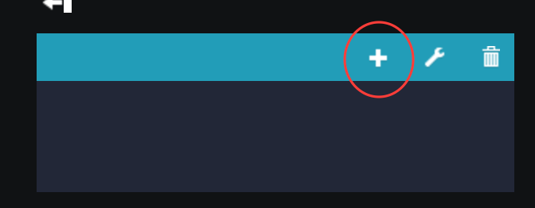
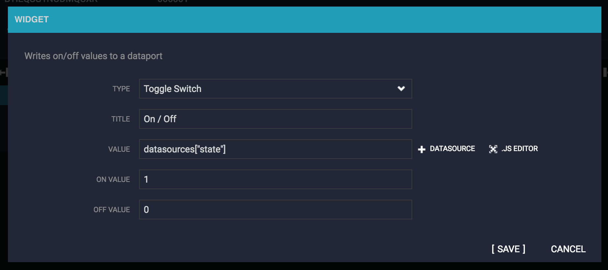
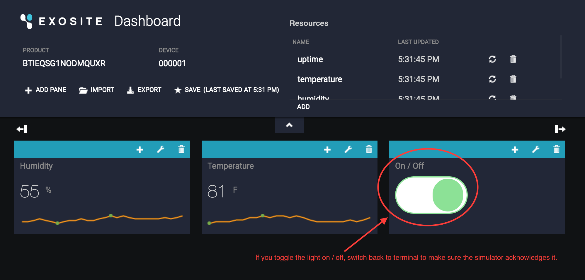
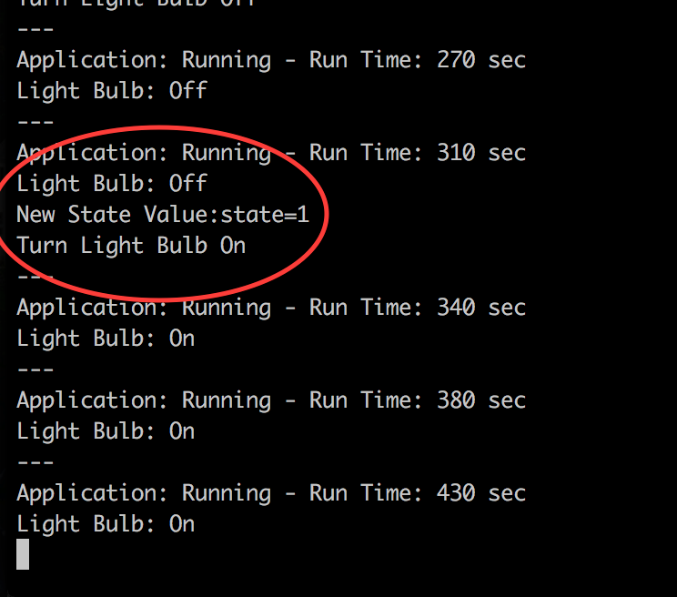

# SIMULATE A DEVICE USING A PYTHON SCRIPT
**NOTE: This is a technical tutorial. You’ll need some familiarity with your operating system's terminal. In order to complete this tutorial you will need python installed on your system. If you haven’t used Python before, download and install it here: [https://www.python.org](https://www.python.org/)**

In this tutorial, we'll simulate a device based on the "Connected Lightbulb Example" and see data on your dashboard.


# STEP 1: ADD EXAMPLE PRODUCT AND DEVICE

If you haven’t already, [CREATE A PRODUCT](http://exosite.io/business/products) using the connected lightbulb example:



When you click on the "Definition" tab, it should look like this:


Now add a device with identity 000001, like so:


It should show up in your list as not activated. Now we'll use the python device simulator to activate that device and start simulating data.


# STEP 2: RUN THE PYTHON DEVICE SIMULATOR

Open your OS terminal and clone the python simulator repo
```
git clone https://github.com/exosite/murano_python_device_simulator_example.git
```

```
cd murano_python_device_simulator_example
```

Run the device simulator
```
python murano_device_simulator.py
```

It will ask you for your ProductID. On your browser, navigate to your product on Exosite and copy your Product ID



Paste it into terminal and hit enter


Then hit the enter key to use the default device identity (000001) - this matches the identity of the device you added earlier, so it will activate correctly.

**Note: If you've already added 000001 and simulated the device before, you may need to create a device (e.g. 000002), and change the default identity on the simulator. This will activate a new device and simulate data for it.**

The script should show that the device has been activated and whether the lightbulb is on or off. Change back to your browser and make sure the device has been activated and data is showing up on the platform:



Awesome! Now you have a simulated device pumping data into Exosite. 


# STEP 3: CREATE THE DASHBOARD

On your browser, select the device you just created (most likely 000001) and open the Dashboard:


Add a text pane for temperature and include sparkline
 
 
 

Do the same for Humidity. Then add a toggle switch for your light:
 

Now try turning the light on and off for the simulated device. Hit the toggle switch on your dashboard, then switch to terminal (while the simulator is running) and make sure the simulator acknowledges it.
 
 

Congratulations - you just remotely turned a simulated device sensor on and off.

Next, [CREATE A SOLUTION](http://beta-docs.exosite.com/murano/get-started/solutions/exampleapp/)


