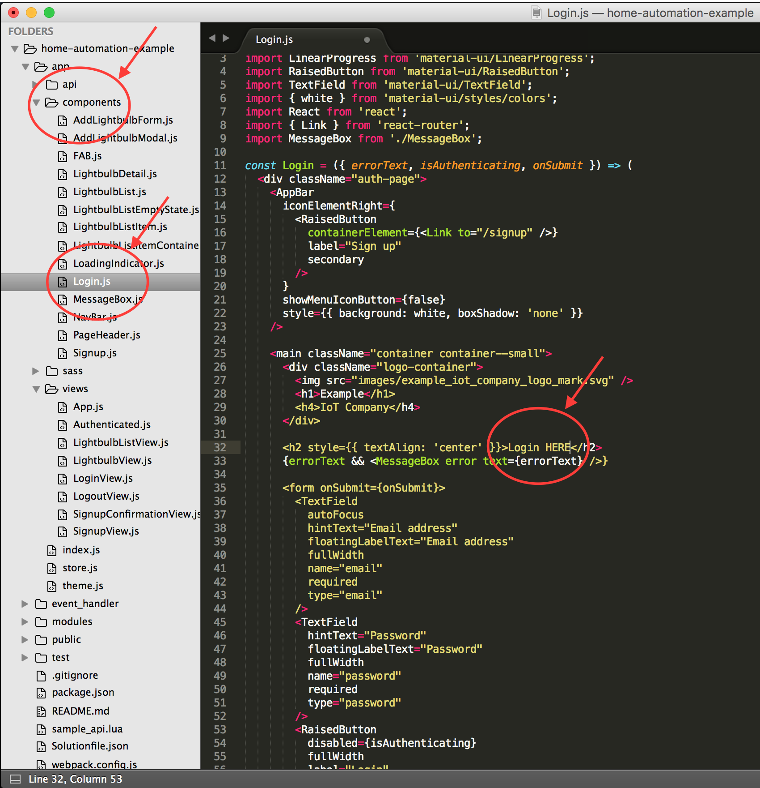

# GETTING STARTED - CREATE A SOLUTION & DEPLOY CHANGES
This is a quick start guide to using Exosite Murano Solutions.  When you are done following this guide, you will have built, deployed, and used an example IoT application with the following features:

* User Login
* User Profiles
* Device Provisioning
* Real Time Device Data
* Device Control

If you already have a Murano account, lets get started! 

and if not

<a class="btn orange" href="https://exosite.com/business/signup">Sign Up for Beta Access to Murano</a>


#STEP 1: Create a solution

Create a solution using the home automation example as a starting point here: (https://www.exosite.io/business/solutions)


**Note: You may have to delete your previous solution if you are on a free account.**

To verify the Template File worked, click the "Routes" menu item - you should see something like this: 


You now have a responsive web app communicating with the connected product! 

#STEP 2: TRY OU TTHE EXAMPLE APP

Sign up for an account on your new example app. 

**NOTE: You won’t be able to login with your Exosite Murano credentials. This is a totally separate application that you just deployed on the Murano platform, with a separate user database.**

Click on the email verification link. 

In your application, add a lightbulb using the MAC address/serial number of the device you added earlier from the python simulator or the Sparkfun ThingDev board. 

You should see data from the lightbulb - current humidity, temperature, and on/off state! 


If you haven’t already, [CREATE A PRODUCT](http://beta-docs.exosite.com/murano/get-started/products/pythonsim/)


#ADVANCED: DEPLOY CHANGES TO THE EXAMPLE SOLUTION 

**NOTE: This is a technical tutorial. You’ll need some familiarity with your operating system’s terminal. In order to complete this tutorial, you will need git, node.js & nam, and python & pip installed on your system. 

Clone this github repo: 


CD to the directory

```
cd home-automation-example
```

Install the Murano CLI

```
$sudo pip install exosite
```

To confirm it’s working, type in: 

```
pip-h
```

**If it returns “command not found”, you may need to install pip with brew on your specific OS.***
***NOTE: In OS X, you may need to go around the built-in system dependencies on “six” by running: 
```
$ sudo pip install --upgrade exosite --ignore-installed six --ignore-installed prompt-toolkit --ignore-installed requests
```

Once you’ve successfully installed the Murano CLI, do 

```
npm install
npm run compile
exosite --init
```

Don’t have npm?

Login with your Exosite credentials, and enter your product and solution IDs (hint: try the typeahead)


Make a change to home-automation-example>app>views>Login.js

I’ll change the <h2> text from “Login” to “Login HERE” to make sure my changes are working. 



Then compile your code

```
nam run compile
```

And deploy your solution from the top level directory (you may need to cd back up to home-automation-example directory)

```
exosite —deploy
```

Open the URL (cmd/ctrl + click to open in default browser, or copy paste the link)


#Voila! Your Changes have been deployed: 


#SETTING UP LOCAL DEVELOPMENT

To run the web application static assets locally, create a .env file in the root of the project with your solution URL, like this (name it anything):

API_BASE_URL=https://<solution-name>.apps.exosite-dev.io

**NOTE: the Chrome plugin in the next step may change the appearance of certain websites (e.g. github.com) until you disable it. You can easily disable the plugin by going to Chrome > preferences > Disable ModHeader**

Install this [Chrome Plugin](https://chrome.google.com/webstore/detail/modheader/idgpnmonknjnojddfkpgkljpfnnfcklj/related?hl=en) and import this configuration: 

```
{"title":"Local Debugging","hideComment":true,"headers":[{"enabled":true,"name":"","value":"","comment":""}],"respHeaders":[{"enabled":true,"name":"Access-Control-Allow-Origin","value":"http://localhost:8080","comment":""},{"enabled":true,"name":"Access-Control-Allow-Credentials","value":"true","comment":""}],"filters":[],"appendMode":""}
```


