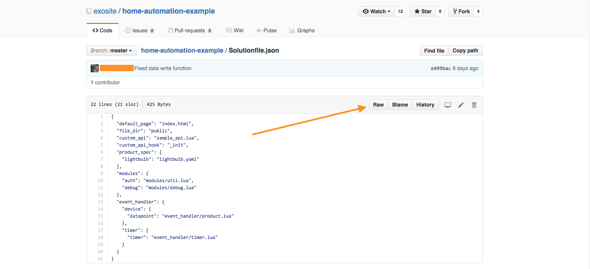
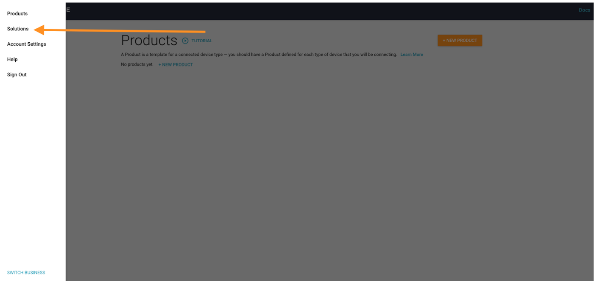
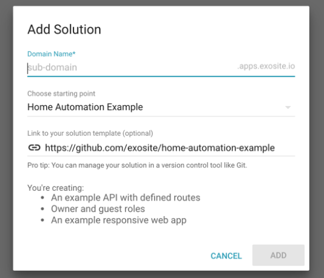
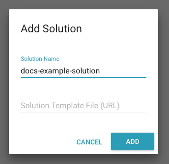
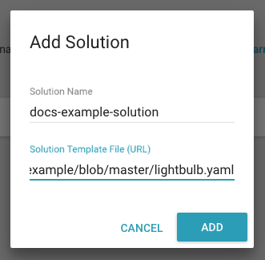
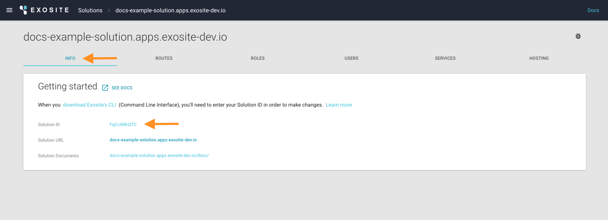

# Murano - Solution Example Application
This is a quick start guide to using Exosite Murano Solutions.  When you are done following this guide, you will have built, deployed, and used an example IoT application with the following features:

* User Login
* User Profiles
* Device Provisioning
* Real Time Device Data
* Device Control

If you already have a Murano account, lets get started!  Otherwise: <a class="btn orange" href="https://exosite.com/business/signup">Create A Murano Account Now</a>

This tutorial assumes you have some familiarity with your operating system's terminal. In order to complete this tutorial you will need the following installed on your system:

* [git](https://git-scm.com/)
* [node.js & npm](https://nodejs.org/en/download/)
* [python & pip](https://www.python.org/downloads/)

# Step 1: Copy an example solution to your machine
Although there are a number of example solutions to choose from, this guide will use the Home Automation Example ([home-automation-example](https://github.com/exosite/home-automation-example)) project.

You can either clone  the [home-automation-example](https://github.com/exosite/home-automation-example)  master repository (https://github.com/exosite/home-automation-example.git) directly, or fork the example and clone it onto your machine.  We recommend the latter as it will allow you to save the changes you make to your application and share them with your team.

To fork the example, login to github (or [create an account](https://github.com/join)), go to the [home-automation-example](https://github.com/exosite/home-automation-example) project and click "fork": 

On your new project page, copy the clone link: 

Open a terminal window on your machine and clone the repository using `git clone <your_repo_clone_link>`: 

You will need the URL to your raw Solutionfile.json file for the next step - navigate to the Solutionfile.json file, click the "RAW" button, and then copy the URL from your browser address bar: 

# Step 2: Create a new solution
Now, sign into the Murano and click on the hamburger in the upper left corner to expose the side menu: 

From the side menu, choose the “Solutions” option: 

To start with a simple example application, click the orange “+New Solution” button in the upper right corner of the Solutions page: 



You will then see the “Add Solution” pop-up, where you can name and define your Solution. Populate the Solution Name with a name that can be used in a url. This name can contain lower-case letters and “-”. An example:



Next, paste the URL of the raw .json descriptor file from the previous step into the Solution Template File (URL) line, and click blue ADD button in the bottom right corner: 

You will now see your solution listed! 

To verify the Template File worked, click the "Routes" menu item - you should see something like: 

Although your new solution is configured, it is not yet live.  We will build and deploy the solution in the next steps...

# Step 3: Install the Murano CLI and tools

Open a terminal window and navigate to the git repository folder you cloned in step 1 (has the Solutionfile.json file in it).  Install npm and ensure you have the latest version:

```
$ sudo npm install npm -g
```

Install the app's dependencies:

```
$ npm install
```

Compile the exapmle app:

```
$ npm run compile
```

OK!  Now we're ready to initialize and deploy your solution application

# Step 4: Initialize and Deploy the app

First, install the `murano` CLI application:

```
$ sudo pip install exosite
```

Initialize your solution:

```
$ murano --init --host biz-internal-api.exosite-dev.com
```

This will ask you for your Murano user name and password.

Then it will ask for your Solution ID: 

And your Product ID: 

You should see the message `Credential file '.Solutionfile.secret' is created, please  run again with no '--init' option.` - this means you are ready to deploy!

Deploy your application with

```
murano --deploy --host biz-internal-api.exosite-dev.com
```

You should then see `Solution URL: https://thingdevexample.apps.exosite-dev.io`

You can verify your solution is up and running by loading that URL in a web browser and playing around with your application!  

# Step 5: Test and Innovate!
You can now develop locally, compile your app, and push to the cloud.

After making changes, simply run ```npm run compile``` and then ```murano --deploy --host biz-internal-api.exosite-dev.com``` to deploy your IoT Solution!

For more information about the powerful capabilities of Routes and Services (not to mention Hosting, Users, Roles and more, please check out our getting started documentation)


