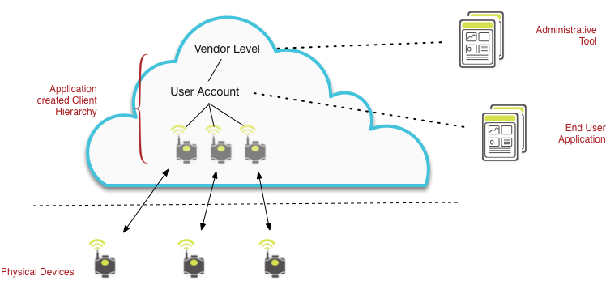
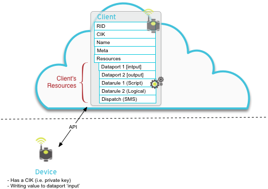
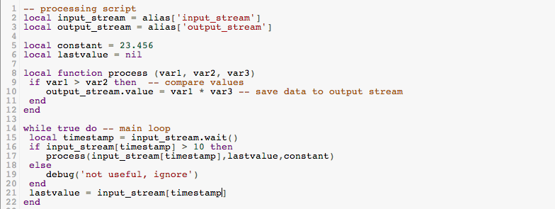

# Exosite One Platform

* [Overview](#overview)
* [Hosting](#hosting)
* [Core Resources and Hierarchy](#core-resources-and-hierarchy)
* [Provision System](#provision-system)

# Overview
The One Platform is Exosite's core IoT building block.  The platform allows for virtualizing and digitizing physical things and their data.  It gives an identity in the 'cloud' to devices and becomes a central node for data to and from the device, to and from user applications, and to any other service you want to connect with.

The interaction with the platform is via a set of web service APIs ([Application Programming Interface](https://en.wikipedia.org/wiki/Application_programming_interface) ).  These APIs allow developers to both connect devices and build applications with.  All data is stored in reference to each individual client (device) and is accessible using the APIs.

[API Overview](/)

The platform allows for storage of time-stamped data, triggering rules on incoming data, triggering dispatches such as HTTP, SMS, and Email, and stream processing of the data using Lua scripts to perform advanced automated functions.  In addition - the platform has a provisioning system that allows vendors to deploy fleets of devices with an approach for activation, defining ownership, and providing content such as new firmware to groups of specific products.

**Key Services**
* [Device / Node representation](#clients)
* Device Modeling
* [Time Series Data](#dataports)
* [Email/SMS/HTTP message dispatching](#dispatches)
* Device Provisioning
* Device Firmware  / Content hosting for in field Updates
* [Lua Scripting](#scripts) - Data stream processing and management

# Hosting
The One Platform is accessible by default to users as a multi-tenant hosted system.  Options for single-tenant hosted instances or self hosting are available, please contact us for more information.

# Core Resources and Hierarchy
## Clients

The core node or object in the platform is a 'client'.  A client typically represents a virtual device, but clients are also used for other purposes - such as for an account, a container of some kind, or a user.  These types of uses of clients generally are in regards to the ownership hierarchy.  A client can own or be owned by other clients.  

A client is identified in the platform by it's RID (Resource Identifier) which never changes. Any authorized ancestor owner of a client can access a child client using it's RID. Each client also has a CIK (Client Interface Key) that is generated and is used by API calls as the authorization for accessing that clients data and attributes.  A CIK is comparable to a private key, where-as the RID is comparable to a public key.

A Client's attributes include the following:
* RID - Resource Identifier
* CIK - Client Interface Key
* name - A string for application-specific purposes (it has no relation to identity in the platform)
* meta - A string field for meta data to be used for application-specific purposes
* locked - if set to true - will prevent any use of the CIK to make API calls
* public - If set to true, allows any other resource in the platform to read from it.  If false, only it's ancestors.
* limits - Is an object containing limits for various entities and consumables.
* resources - Any resources such as dataports, datarules, dispatches, and other clients owned by this client.

In addition - by asking for 'info' about a client, you can receive the following information:
* aliases
* modified time, status, subscribers, type
* counts
* usage

## Resources
Each client has functional resources that allow for storing, processing, and taking action on data.  There are no limits to how many of each resource are used, although applications should optimize based on performance for things like user applications.

* [Dataports](#dataports) - Time series data stores
* [Datarules](#datarules) - Logical data rules on published data
* [Dispatches](#dispatches) - Triggered messaging
* [Scripts](#lua-scripts) - Lua scripts interacting with the other resources

### Resource Attributes
Each resource has similiar attributes as clients.  Each resource has a name, a meta field, and public field.  In addition, all resources have the following that are unique to resources.  Each type of resource also has it's own set of attributes specific to that resource.

__Attributes across all resources__
* [Resource Identifier / RID](#alias-/-rid)
* [Alias](#alias-/-rid)
* name
* Meta
* public
* format - Format of stored data -'integer', 'float', 'string'
* [preprocess](#preprocess)
* [retention](#retention)
* [subscribe](#subscriptions)

#### Alias / RID
Each resource has a Resource ID (RID) that may be used with the RPC API.  To simplify interactions with the API, resources may also use Aliases, which can be used with the APIs.   An Alias is a simple string that is mapped to a RID.  Each alias is unique to that client.  For example, a dataport that is storing sensor data like temperature, may use an alias of 'temp' or 'temperature'.  

Note that owned clients may also have aliases since clients are also resources.

#### Preprocess
The preporcess function for resources allows a value that is written to the resource to be manipulated before storing the value.  In general, it is a list of `[<operation>, <value> | <ResourceID>]` pairs describing operations to be performed on incoming data.  The operations may be `"add"`, `"sub"`, `"mul"`, `"div"`, `"mod"`, `"gt"`, `"geq"`, `"lt"`, `"leq"`, `"eq"`, `"neq"`, or `"value"`.  The operations are performed in order as listed in the list and may use a constant value or another resource's current value.

_Note that the preprocess operations will only be performed when new values are written to this specific resource.  New values for resources that some of the operations are using will not trigger the preprocess operation._

#### Retention
The dataport, datarule, and dispatch resources each store values in a historical data store with timestamps.  Each resource can set it's own unique retention settings, which are 'count' and 'duration'.  These retention settings allow developers to control the amount of data stored for each resource.  Any values that our outside of these retention settings will be removed at some point by the platform.  Note that values outside the retention windows may not be immediately removed.  

  `"count"` is the maximum number of entries this resource will retain.

  `"duration"` is the maximum number of hours this resource will retain its data.

_Note: A count of '0' will never store the value._

#### Subscriptions
A resource may be subscribed to one other resource.  When used, the `"subscribe"` field is set to an RID to which this resource is subscribed, or null if it is not subscribed to another resource. If set to an RID, this resource will receive a publication whenever a value is written to the specified RID.  

Subscriptions are the most common way a dispatch or datarule is used.  For example, a simplified use case is a that there is a dataport with sensor data being written to it.  A datarule could be created that is subscribed to this dataport and a dispatch is subscribed to the datarule.  The datarule receives the new value from the dataport, runs through it's rule logic and it's stored value is a 1 or 0.  The dispatch receives this value in which it also uses a preprocess value to evaluate if equal to 1 - if yes, it will fire off it's dispatch, like an email to a user.

## Dataports
Dataports are a simple data store of time stamped values that can be written and read from.  Data written to a dataport (Write function) is stored with a platform provided unix timestamp. Data written with the Record function uses a timestamp provided with the value.  

Dataports have type 'integer', 'float' or 'string'.  When using string types, the maximum size of a value that can be written is 64KB.  Formatted data, such as JSON can be stored as string type, with the JSON object written as a string.

An example of a dataport use is a device with a temperature sensor, the type being float.  Writing a value of 24.2 will result in the platform storing this value the timestamp in which it was received.  A user application with a graph may call the read API and request the last 5 minutes of data values.

Dataports can publish data to other dataports, datarules, and dispatches.  Scripts can read, write, and wait on dataports.  

## Datarules
Datarules perform a logical function on an incoming value with the stored outcome as either a 0 (false) or 1 (true).  These logical functions are described as it's `"rule"` attribute, which is unique to datarules.  Datarules are otherwise the same as a dataport, they have all of the other attributes such as preprocessing, subscription, and retention.

Reading from a datarule will provide 0 and 1 values with timestamps in which the datarule ran.

The logical `"rules"` that may be performed are as follows:

<table><tr><th>Rule</th><th>Description</th></tr>
<tr><td>
<pre><code>
{
    "simple": {
        "comparison": "gt" | "lt" |
                      "eq" | "geq" |
                      "leq" | "neq",
        "constant": number,
        "repeat": boolean
    }
}
</code></pre>
</td><td>

Values received by this rule are compared to a numerical constant and the result is the boolean result of that comparison.
<ul>
<li><code>"constant"</code> is a numerical constant used by comparison</li>
<li><code>"comparison"</code> is the comparison to perform.</li>
<li><code>"repeat"</code> specifies whether new inputs that would not change
the output should be written to the output data stack anyway. If set to
<code>true</code>, the output of this rule is always written to the rule's
data stack. If set to <code>false</code>, a output is only written if it's
different from the previous value.</li>
</td></tr>
<tr><td>
<pre><code>
{
    "timeout": {
        "timeout": number,
        "repeat": boolean
    }
}
</code></pre>
</td><td>

Output <code>true</code> if no input value is received within a timeout period. If an input value is received within the period, output <code>false</code>. The timer is restarted when an input value is received, when the timeout elapses and when the script is first started. A timeout value of 0 indicates that the timeout shall not repeat.

<ul>
<li><code>"timeout"</code> is a timeout in seconds</li>
<li><code>"repeat"</code> specifies whether new inputs that would not change
the output should be written to the output data stack anyway. If set to
<code>true</code>, the output of this rule is always written to the rule's
data stack. If set to <code>false</code>, a output is only written if it's
different from the previous value.</li>
</ul>

</td></tr>
<tr><td>
<pre><code>
{
    "interval": {
        "comparison": "gt" | "lt" |
                      "eq" | "geq" |
                      "leq" | "neq",
        "constant": number,
        "timeout": number,
        "repeat": boolean
    }
}
</code></pre>
</td><td>

This rule outputs the result of the comparison any time an input value is received.
Additionally, if the comparison result is <code>true</code>, a timer is
started. If the timer elapses, the rule output becomes <code>true</code>,
and the timer is restarted. If a input value is received that makes the comparison
<code>false</code>, <code>false</code> is output and the timer is canceled.

<ul>
<li><code>"comparison"</code> is the comparison to do</li>
<li><code>"constant"</code> is a numerical constant used by comparison</li>
<li><code>"timeout"</code> is a timeout in seconds</li>
<li><code>"repeat"</code> specifies whether new inputs that would not change
the output should be written to the output data stack anyway. If set to
<code>true</code>, the output of this rule is always written to the rule's
data stack. If set to <code>false</code>, a output is only written if it's
different from the previous value.</li>
</ul>
</td></tr>
<tr><td>
<pre><code>
{
    "duration": {
        "comparison": "gt" | "lt" |
                      "eq" | "geq" |
                      "leq" | "neq",
        "constant": number,
        "timeout": number,
        "repeat": boolean
    }
}
</code></pre>
</td><td>

When a value is received, it is immediately used in the configured
comparison.  If the comparison result is <code>true</code>, the rule waits for
the specified timeout period before setting its output to <code>true</code>.
If instead the comparison result is <code>false</code>, then
<code>false</code> becomes the output of the rule immediately, cancelling
any existing timeout.

<ul>
<li><code>"comparison"</code> is the comparison to do</li>
<li><code>"constant"</code> is a numerical constant used by comparison</li>
<li><code>"timeout"</code> is a timeout in seconds</li>
<li><code>"repeat"</code> specifies whether output from this rule should
be written to its data stack if it is the same as the latest
value already on the data stack. If set to <code>true</code>, the output of
this rule is always written to the rule's data stack. If set to
<code>false</code>, a output is only written if it is different from the
previous value.</li>
</ul>
</td></tr>

<tr><td>
<pre><code>
{
    "count": {
        "comparison": "gt" | "lt" |
                      "eq" | "geq" |
                      "leq" | "neq",
        "constant": number,
        "count": number,
        "timeout": number,
        "repeat": boolean
    }
}
</code></pre>
</td><td>

When a value is received it is used in the comparison. If the comparison
result is <code>true</code> and there is no existing timeout then a timeout
is started and an internal counter is set to <code>1</code>. If a timeout
already exists then the internal counter is incremented. If the internal
counter matches the count configuration parameter, then the timeout is
restarted, the internal counter is set to <code>0</code> and the condition
evaluates to <code>true</code>. If the timeout elapses, the counter is set
to <code>0</code>, the timeout is cancelled and the rule outputs
<code>false</code>.

<ul>
<li><code>"comparison"</code> is the comparison to do</li>
<li><code>"constant"</code> is a numerical constant used by comparison</li>
<li><code>"count"</code> is the number of data points accumulated that satisfy the comparison</li>
<li><code>"timeout"</code> is a timeout in seconds</li>
<li><code>"repeat"</code> specifies whether output from this rule should
be written to its data stack if it is the same as the latest
value already on the data stack. If set to <code>true</code>, the output of
this rule is always written to the rule's data stack. If set to
<code>false</code>, a output is only written if it is different from the
previous value.</li>
</ul>
</td></tr>
<tr><td>
<pre><code>
{
    "script": string
}
</code></pre>
</td><td>
<code>"script"</code> is a string containing Lua source code to run on the server.  Yes, scripts are actually a version of a datarule.
</td></tr>
</table>

Although the type for a datarule can be integer, float, or string, the most common type is as an integer.  

## Dispatches
A dispatch resource allows for triggered messages and communications from the platform to an external destination.  The available dispatch methods are SMS, Email, HTTP POST, HTTP PUT, HTTP GET, and XMPP.  In addition to the standard resource attributes, a dispath also includes the fields for `"method"`, `"recipient"`, `"message"`, and `"subject"`.

* `"method"` is the method to be used to deliver messages by this dispatch resource. Current methods are: "email", "http_get", "http_post", "http_put", "sms", "xmpp"
* `"recipient"` is the intended recipient for messages from this dispatch resources. It must be a valid email address, phone number, URL, or xmpp address, depending on the configured delivery method.
* `"message"` is the message to dispatch. If this string is empty, the value output from the preprocessing stage will be output instead.
* `"subject"` is the subject string for delivery methods that support a subject line.  Only used with email method.

Dispatches store a string value the specifies if a message was successfully sent.  A read from a dispatch resource would return the status and timestamp of each message attempt.  

### Message Substitutions
The messages for dispatches may either take the value passed into the dispatch (after preprocessing stage) or may use a defined string.  Values may still be passed into the message when using a defined string, using substitutions.  The available string substitutions are as follows:
* ``[[value]]`` - The value passed into this dispatch
* `[[subscribe.cid]]` - The RID of the client of this resource.

## Lua Scripts
The most powerful of the resources available in the platform clients are [Lua](http://www.lua.org/manual/5.2/) Scripts.  The scripts have access to all of the other resources for that client, including any child clients.  This allows developers to processing incoming data into the dataports, trigger actions or alerts, and manage resources based on the state of different data and time.  

[One Platform Lua Scripting Reference Guide](/scripting)

**A few use cases are:**
* Advanced data analytics using math functions and multiple dataports
* Parse raw data packets and split into individual dataports
* Perform conversion of data as it comes in
* Send out dispatches (Email, SMS, XMPP, HTTP,Twitter)
* Send data to other systems
* Perform initialization functions

# Provision System
The Provision system reference is contained in knowledge base articles found here.

[Provisioning Articles](https://support.exosite.com/hc/en-us/articles/200308457-Provisioning-Overview)

# Help
Looking for answers you may have yet?  Check out the Exosite support site [knowledge base articles on the One Platform](https://support.exosite.com/hc/en-us/sections/200072527).
