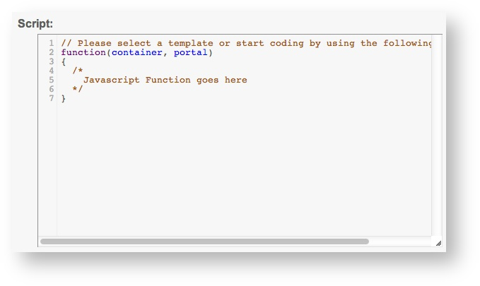
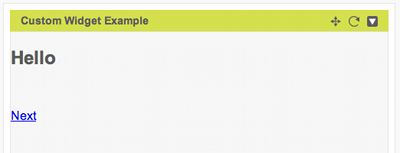
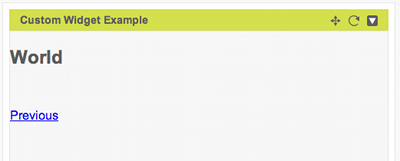
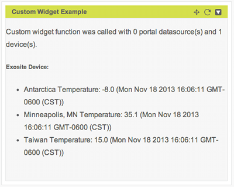

# Custom Widget API

Portals provides a Javascript API for developing custom dashboard widgets. If you need to develop a custom widget, you've come to the right place. This document will describe how to create a custom widget in Portals, the data Portals passes to widgets when they load, and the API widgets can use to interact with Portals and the One Platform.

### Functions 

[read](#read) - read data from a One Platform resource

[write](#write) - write a single point to a One Platform resource

[update](#update) - update a One Platform client (e.g. device) description

[drop](#drop) - delete a client (e.g. device)

[subscribe](#subscribe) - register a callback function to handle a widget UI event

[publish](#publish) - publish a widget UI event to registered callback functions 

[getWidgetInfo](#getwidgetinfo) - get information about the current widget


## Create a Widget

To create a custom widget on a Portals dashboard:

- Click the Add Widget button in the upper right

- Set the Widget Type to Custom Widget, enter a title of your choice, and click Continue.

- Set the Widget Size. Portals dashboards are laid out in a grid, and the Widget Size is defined in grid units. Each grid unit in Portals is 248px wide and 204px tall, with default spacing of 16px. The spacing is included in the widget's width, but not its height. So, for example, the default setting of 2x2 defines a widget that is 2 * 248px + 16px = 512px wide but only 2 * 204px = 408px tall. Here's an illustration of the dashboard layout:


Note that the maximum width of a widget is 4 grid units, since that is the default maximum width of a custom dashboard. The dashboard width may also be increased to 6 grid units, which allows wider widgets. The widget height does not have a maximum for practical purposes. 

- Select the device data sources this widget will use.

- Select the range of data the widget will consume, in number of points (e.g. last 1 point) or time period (e.g. all points in last 2 days).

- Optionally select a script template to use as a starting point.

- Enter script code.



- Press Save.

- The new widget is displayed in the dashboard.

Note that the these setup instructions cover portal-level widgets. With a [whitelabel account](http://exosite.com/platform/oem-whitelabel/) you can also create widgets at the domain level and that can operate on types of devices (client models in Exosite terminology) without needing to be configured with a concrete device. The API for domain widgets is identical to portal widgets, but the setup process is somewhat different and not covered here.

## Widget Function

Custom widgets define a function that is called by their containing sandbox environment when they are loaded. The following example displays "Hello World" inside its widget container area.

```javascript
function(container, portal) {
    /* CODE HERE */
    $(container).html("Hello, World!");
}
```

The widget function takes two parameters: `container` and `portal`.

- `container` is an HTMLDivElement container for the widget. It can be used to write widget content. For more information, see [Widget Container](#widget-container).

- `portal` is a Javascript object containing a snapshot of device and dataport information, including datapoints. For more information, see [Portal Resources](#portal-resources).

## Widget Container

The first argument to the [widget function](#widget-function) is a HTMLDivElement container. By injecting HTML, CSS, and Javascript into this container, it's possible to create a wide variety of custom widgets that make use of data from the One Platform. The following examples illustrate techniques for working with the widget container.

To display HTML content in a widget, write the HTML as a string to the container.

```javascript
function(container, portal) {
    $(container).html("<h2>Hello, World!</h2>");
}
```


To style the HTML contents using CSS, you can inject a `<style>` element in the HTML. With a whitelabel account, you also have the option of defining styles separately in the domain level CSS.

```javascript
function(container, portal) {
    // set h2 header style to green
    var html = '<style type="text/css">';
    html += 'h2 { color: #0000EE; }';
    html += '</style>';

    html += '<h2>Hello, World!</h2>';

    $(container).html(html);
}
```


To react to a user action, attach a Javascript event handler to an element.

```javascript
function(container, portal) {
  function showPage1() {
    $(container).html('<h2>Hello</h2><br><a id="next_button" href="javascript:void(0)">Next</a>');
    $("a#next_button").click(function() {
      showPage2();
    });
  }
  function showPage2() {
    $(container).html('<h2>World</h2><br><a id="prev_button" href="javascript:void(0)">Previous</a>');
    $("a#prev_button").click(function() {
      showPage1();
    });
  }
  showPage1();
}
```

 

To read data from the platform, a widget may read data passed from the [portal resources](#portal-resources) argument to the widget function. Note that you have to select a Data Source in the widget configuration to see any output listed.

```javascript
function(container, portal) {
    var html = '<p>Custom widget function was called with ';
    html += portal.dataports.length;
    html += ' portal datasource(s) and ';
    html += portal.clients.length;
    html += ' device(s).</p>';

    html += '<p>';
    $.each(portal.clients, function(idx, client) {
       html += '<h5>' + client.info.description.name + ':</h5>'; 
       html += '<ul>';
       $.each(client.dataports, function(idx, dataport) {
         // display dataport name
         html += '<li>' + dataport.info.description.name + ': ';
         if (dataport.data.length > 0) {
           var latest_point = dataport.data[dataport.data.length - 1]; 
           html += latest_point[1];
           html += ' (' + new Date(latest_point[0] * 1000) + ')';
         } else {
           html += 'no data points available';
         }
         html += '</li>';
       });
       html += '</ul>';
    });
    html += '</p>';
    
    $(container).html(html);
}   
``` 



It's also possible to use the `read` widget API function to get data from the One Platform. The advantage of this method is that you can do it after the script has been loaded. For an example, see the [documentation for read](#read).


## Portal Resources

The second argument to the [widget function](#widget-function) is a Javascript object containing a snapshot of device and dataport information at the time the widget loaded. The object has this format:

```
{ 
  "clients": [Client,...],
  "dataports": [Dataport,...] 
} 
```

### Client

Each `Client` contains JSON formatted information from the client in the One Platform including its alias, name, meta, and array of dataports (data sources).

```
{
  "alias":string :: null,
  "dataports":[Dataport,...],
  "info":{
    "description":{
      "meta":DeviceMeta,
      "name":string :: "" 
    }
  }
}
```

`DeviceMeta` is a JSON string that may be parsed with [`JSON.parse()`](https://developer.mozilla.org/en-US/docs/Web/JavaScript/Reference/Global_Objects/JSON/parse). It contains the meta information for the client in the One Platform.
```
{
  "activetime":ActiveTimeRange,
  "timezone":Timezone,
  "location":Location,
  "device":{
    "type":"generic" | "vendor"
  }
}
```

- `"ActiveTimeRange"` is a string set by the number of minutes user input in the device popup. If the device received any data source within the last N minutes, the device is considered to be active. N here is the ActiveTimeRange.

- `"Timezone"` is a string set by the timezone user chose in the device popup.

- `"Location"` is a string set by the location user input in the device popup.

### Dataport

`Dataport` contains JSON formatted information from the dataport in the One Platform including its alias, name, meta, format, and array of data values.  

```
{
  "alias":string :: null,
  "data":[[Timestamp ,Value],...],
  "info":{
    "description":{
      "format": "float" | "integer" | "string",
      "meta":DataSourceMeta,
      "name":string :: ""
    }
  }
}
```

`DataSourceMeta` is a JSON string that may be parsed with [`JSON.parse()`](https://developer.mozilla.org/en-US/docs/Web/JavaScript/Reference/Global_Objects/JSON/parse). It contains the meta information for the dataport in the One Platform.
```
{
  "datasource":{
    "unit": string :: ""
  }
}
```

- `unit` is a string set by the user input in the device popup.


## Portal Resources Example

The above section defines the individual parts of the portals resources object passed to the [widget function](#widget-function). Let's bring that together by looking at a concrete example. Here's an custom widget configured to load the temperature in Antarctica from the virtual device that comes with a new Portals Community account.


In the example widget code, the line `console.log(JSON.stringify(portal, null, 2));` converts `portal` to a string so that we can see its contents in the browser console. Here's the output of that script, with comments added.

```
{
  // portal level dataports
  "dataports": [],
  // devices configured to be included
  "clients": [
    {
      // this device has no alias assigned
      "alias": null,
      "info": {
        "description": {
          // Portals-specific metadata
          "meta": "{\"timezone\":\"America/Chicago\",\"location\":\"United States\",\"device\":{\"type\":\"generic\"}}",
          // device's name
          "name": "Exosite Device",
          // whether the device is public
          "public": false
        }
      },
      // dataports contained in this device
      "dataports": [
        {
          // dataport alias
          "alias": "Antarctica Temperature",
          "info": {
            "description": {
              // format of dataport data
              "format": "string",
              // Portals-specific metadata (see below)
              "meta": "{\"alias\":\"antarctica_temperature\",\"datasource\":{\"description\":\"Temperature data for Antarctica\",\"unit\":\"°C\"}}",
              // dataport name
              "name": "Antarctica Temperature",
              // no preprocessing
              "preprocess": [],
              // this is a public dataport 
              "public": true,
              // how much historical data to retain
              "retention": {
                "count": "infinity",
                "duration": "infinity"
              },
              // see RPC info command 
              "subscribe": null
            }
          },
          "data": [
            // single datapoint
            [
              // unix timestamp
              1384536323,
              // temperature value
              "-8.0"
            ]
          ]
        }
      ]
    }
  ]
}
```

In the example, we learn that the temperature in Antarctica on Nov 15, 2013 at 5:25PM UTC was -8°C. The name of the device producing this data is "Exosite Device".

## Data Availability

The contents of the `portal` parameter are are based on what dataports and time periods are set in the widget configuration. 

In the case of a domain widget, a domain administrator may additionally select a client model whose data should be included.

## Procedures

The custom widget sandbox environment exposes an API of functions for interacting with Portals and the One Platform. 

### read

Reads data from the One Platform resource(s) specified. This throws an exception if there is any error in the arguments.

```
read(TargetResource, Options) -> Deferred
```

- `TargetResource` is an array with the following format, where `DeviceAlias` and `DataportAlias` are strings.
```
[
  DeviceAlias,
  DataportAlias
] 
```

- `Options` has the following format: 
```
{
  "starttime":number,
  "endtime":number,
  "limit":number,
  "sort":"asc" | "desc"
}
```

- `Deferred` is an object that may be called with `done()` and/or `fail()` callbacks to handle success or failure condition. The callback passed to the deferred object’s done method will get the array of points that were read passed as arguments (each point as one argument).

#### Example

Here's an example of using `read` to read from the device provided with a Portals Community account. (Note that for this example it is necessary to first assign an alias to the device by clicking on Devices -> Exosite Device, setting Alias to `exosite_device`, and pressing the Update button.

```javascript
function(container, portal) {
  var html = 'Latest temperature in Antarctica: <div id="temperature">loading...</div>';
  html += '<div><a class="reload" href="javascript:void(0);">reload</a></div>';
  function reload() {
    // call the read widget API
    var options = {
      starttime: 1,                          // beginning of epoch
      endtime: (new Date).getTime() / 1000,  // current time
      limit: 1,                              // single point
      sort: "desc"                           // latest point
    };
       
    read(['exosite_device', 'Antarctica Temperature'], options)
      .done(function() {
        var data = arguments;
        // update the data.
        var latest_point = data[0];
        var html = latest_point[1] + ' (' + new Date(latest_point[0] * 1000)  + ')';
        $(container).find('div#temperature').html(html);
      })
      .fail(function() {
        $(container).find('span#temperature').html(data);
      });
  } 
  $(container).html(html);
  $(container).find('a.reload').click(function() {
    // read value again when user clicks on "reload" link
    alert("loading!");
    reload();
  });
  // read value when widget loads
  reload();
}
```


### write

Writes a single value to the One Platform resource(s) specified. This throws an exception if there is any error in the arguments.

```
write(TargetResource, Value) -> Deferred
```

- `"TargetResource"` is an array of resource aliases
- `"Value"` may be a number or string value

#### Example
```
try
{
  write(["blog", "message"], "hello")
    .done(function()
    {
      // means succeeded to write to the data source, message, owned by the
      // device, blog.
    })
    .fail(function()
    {
      // means failed to write to the data source, message, owned by the
      // device, blog.
    })
  ;
}
catch ()
{
  // means error in the arguments e.g. ["blog", "message"] is not accessible
  // for this widget or doesn't exist.
}
```

### update

Update a device’s description. This throws an exception if there is any error in the arguments.

```
update(TargetResource, Description) -> Deferred
```

- `"TargetResource"` is an array of device aliases.
- `"Description"` is an object containing `"meta"` (device metadata as a JSON string) and `"name"` (name of device). Note that custom widgets may only modify `"location"` in `"meta"`.
```
{
  "meta":Meta :: "",
  "name":string :: ""
}
``` 

#### Example

```
var description =
    {
      "meta":
      {
        "location": "new location"
      },
      "name": "new name"
    };
description.meta = JSON.stringify(description.meta);
update(["some_device"], description)
  .done(function()
  {
    // means succeeded to update a device
  })
  .fail(function()
  {
    // means failed to update a device
  })
;
```

### drop 

Drop a device. This throws an exception if there is any error in the arguments.

```
drop(TargetResource) -> Deferred
```

- `TargetResource` is an array of device aliases

- `Deferred` is an object that may be called with `done()` and/or `fail()` callbacks to handle success or failure condition.

#### Example

```
drop(["some_device"])
  .done(function()
  {
    // succeeded to drop a device
  })
  .fail(function()
  {
    // failed to drop a device
  })
;
```

### subscribe

Register a callback function to handle a widget event. Once registered, the callback function is called when [`publish`](#publish) is called for the widget event. This may be used to react to user interface events that occur in another custom widget.

```
subscribe(Event, Callback[, SubscribeOptions]) -> undefined
```

- `Event` is the name of the event to subscribe to. This should match the name passed to `publish`. Note that `Event` is not related to Portals events or One Platform datarules. It is an string identifier that is made up by the widget developer for identifying user interface events at the level of an individual dashboard.

- `Callback` is a function to invoke when the event occurs. When this function is invoked, its arguments are the messages passed to the publish function.

- `SubscribeOptions` is an optional object like this:
```
{
  "context": anything :: undefined,
  "id":string :: ""
}
```

- `"context"` is the context of the callback. If specified, this provides the value of the keyword `this` in the callback.
- `"id"` defines the id of the callback. This id is unique among all callbacks of each event. This may be used to prevent a callback from subscribing the same event multiple times.

#### Examples

`subscribe` and `publish` may be used to communicate between widgets. For example, one widget can publish a message to a named event when a link is clicked:

```
function(container, portal)
{
  $(container).html('<a id="publish_button" href="javascript:void(0);">Publish "Hello subscribers!"</a>');
  $('a#publish_button').click(function () {
    // publish to 'myevent'
    publish('myevent', 'Hello, subscribers!');
  });
}
```

...and another widget can subscribe to the event and update its content when it receives a callback:

```
function(container, portal)
{
  subscribe('myevent', function(msg) {
    $(container).html(msg);
  });
}
```

Multiple arguments may be published:

```

// this example demonstrates how the callback parameter works.
subscribe("dinner", function(papasDinner, mamasDinner) {
  console.log(papasDinner, mamasDinner);
});
// this shows "Rice noodle" "Stinky tofu" in the debug console.
publish("dinner", "Rice noodle", "Stinky tofu");
```

Here's an example of the context option:

```
subscribe("birthday", function() {
    console.log(this.name);
  }, 
  { 
    context: { name: 'My context' }  
  }
);

// this displays "My context" in the debug console.
publish("birthday");
```

Here's an example of the id option:

```
var options = { id: "widgetA" };

// this registers a callback for "season" event, 
// identifying the widget making the call
subscribe("season", function() { console.log("Spring"); }, options);

// this registers another callback for "season" event,
// without an id set in options. 
subscribe("season", function() { console.log("Summer"); });

// this registers a callback that prints "Autumn".
// options.id matches the earlier call, so it replaces the
// earlier callback.
subscribe("season", function() { console.log("Autumn"); }, options);

// this shows Autumn and Summer in the debug console, but not 
// Spring since that callback was replaced
publish("season");
```

### publish

Publish a widget event. The optional parameters to `publish` following the event name are passed as parameters to all callback functions that have been registered using [`subscribe`](#subscribe).

```
publish(Event[, Message1, Message2, ...]) -> undefined
```

- `Event` is the name of the event to publish. It is be made up by the widget developer and, for code clarity, should describe the event being published. Note that `Event` is not related to Portals events or One Platform datarules. It is an string identifier that is made up by the widget developer for identifying user interface events at the level of an individual dashboard.

- `Message` may be anything. These arguments are passed to the subscriber callbacks as parameters.

For examples of the `publish` command, see [`subscribe`](#subscribe).

### getWidgetInfo

Get information about of the current widget. If the info of the `PropertyName` doesn’t exist, `undefined` is returned.

```
getWidgetInfo(PropertyName) -> PropertyValue
```

- `"PropertyName"` may take any of the following:

    `"id"` gets the identifier of the current widget in this page. This is useful if two custom widgets shares the same code and they both subscribe to a certain event providing an ID. In this case, only one widget can successfully subscribe to the event. With this function, they both can subscribe to the same event.

- `"PropertyValue"` is the value of the property

#### Example

```
// this example demonstrates how the getWidgetInfo works
var callback,
    options;
options =
{
  id: "color" + getWidgetInfo("id")
};
callback = function()
{
  console.log("yellow");
};
subscribe("color", callback, options);
// this shows "yellow" in the debug console.
publish("color");
```

### Google Loader API

The Google Loader API is available in the widget sandbox. Please see this link for more information:

[https://developers.google.com/loader/](https://developers.google.com/loader/)

## Widget Examples

There are a number of widget examples available in the "Script Template" drop down available when editing a widget.

More example code can be found here: [Custom Widget Example Code](https://github.com/exosite-garage/custom_widget_scripts).

